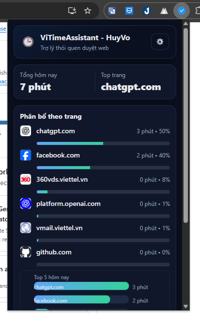
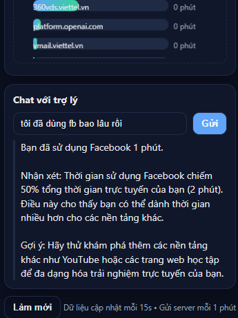

# 🕒 ViTimeAssistant

> Vietnamese Chrome Extension + FastAPI backend that **tracks your browsing time** (e.g. Facebook, YouTube) and gives you **AI-powered feedback** using OpenAI GPT.

<p align="center">
  
  
</p>

---

## ✨ Features

- ✅ **Chrome Extension (MV3)**
  - Tracks time spent on each domain while browsing
  - Detects idle time (no cheating 😅)
  - Beautiful popup dashboard: usage KPIs, progress bars, mini chart
  - Integrated chat with AI assistant (Vietnamese)

- ✅ **Backend (FastAPI)**
  - Receives usage logs & stores in `data.json` (simple JSON datastore)
  - Provides APIs for daily/weekly summaries
  - Calls **OpenAI GPT** to generate short, expert-style usage feedback
  - Saves chat history per user

- ✅ **Storage**
  - JSON-based by default (good for prototyping)
  - Easy migration to SQLite/Postgres later

---

## 📂 Project Structure

```
vi-time-assistant/
├── backend/
│   ├── app.py           # FastAPI server
│   ├── storage.py       # JSON storage helpers
│   └── data.json        # auto-created (ignored in Git)
├── extension/           # Chrome Extension (MV3)
│   ├── manifest.json
│   ├── background.js    # service worker (time tracking)
│   ├── popup.html/js/css# popup UI
│   ├── options.html/js  # settings page
│   └── icons/
└── scripts/
    ├── test_chat.py     # send test chat request
    └── log_fake_usage.py# simulate usage logs
```

---

## 🚀 Getting Started

### 1. Backend Setup

```bash
cd backend
python -m venv .venv
.venv\Scripts\activate   # or source .venv/bin/activate
pip install fastapi uvicorn openai
```

Create `.env` (not tracked by Git):

```
OPENAI_API_KEY=sk-xxxx...
```

Run server:

```bash
uvicorn app:app --reload --port 8000
```

Test API:

```bash
curl -X POST http://127.0.0.1:8000/chat   -H "Content-Type: application/json"   -H "x-api-key: $OPENAI_API_KEY"   -d '{"user_id":"u1","question":"Mình dùng Facebook bao lâu?","usage":{"facebook.com":3600,"youtube.com":1200}}'
```

---

### 2. Chrome Extension Setup

1. Open Chrome → `chrome://extensions/`
2. Enable **Developer Mode**
3. Click **Load unpacked** → select `extension/` folder
4. Pin the extension in toolbar
5. Open popup → click ⚙️ to configure:
   - Backend URL: `http://127.0.0.1:8000`
   - API Key: your OpenAI key
   - User ID: e.g. `u1`

---

### 3. Usage

- Browse normally (Facebook, YouTube, etc.)
- Extension counts time (every 15s tick)
- Every 1 min, usage is flushed to backend
- Open popup:
  - See today’s totals, top sites, mini chart
  - Ask AI assistant in Vietnamese for quick feedback

---

## 📊 API Endpoints

- `GET /` → health check  
- `POST /log_usage` → add one usage record  
- `POST /log_usage_bulk` → add multiple records  
- `GET /today_summary/{user_id}` → today’s totals  
- `GET /week_summary/{user_id}` → last 7 days  
- `POST /chat` → ask AI assistant (requires `x-api-key`)  
- `GET /user/{user_id}` → raw data for user  

---

## 🔐 Security

- `.env` is ignored by Git (never commit your keys).  
- API key is passed from the extension in request headers.  
- For production:  
  - Switch from JSON → database  
  - Restrict CORS origins  
  - Deploy backend securely (HTTPS)  

---

## 🛠 Roadmap

- [ ] SQLite/Postgres support  
- [ ] Alerts when usage crosses threshold  
- [ ] Multi-language support  
- [ ] Cloud deployment (Render / Railway / Fly.io)  

---

## 📜 License

MIT License © 2025 [Your Name]

---

## 🙌 Acknowledgements

- [FastAPI](https://fastapi.tiangolo.com/)  
- [OpenAI GPT](https://platform.openai.com/)  
- [Chrome Extensions Manifest V3](https://developer.chrome.com/docs/extensions/mv3/)  
